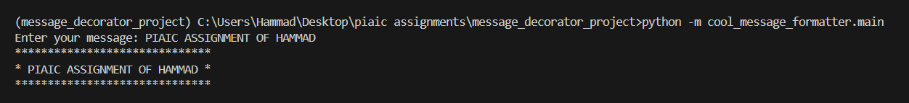

# ✨ Message Decorator Project

This is a simple Python project that takes a user's input message and decorates it inside a rectangle made entirely of `*` (asterisk) symbols.  
The project is divided cleanly into two files:

- `message_formatter.py` → Handles the message decoration logic.
- `main.py` → Takes user input and displays the decorated message.

The project is organized as a Python **package** inside the `src/cool_message_formatter` folder structure.

---

## 📦 Project Structure

message_decorator_project/
 |── venv/ # Virtual environment (after setup)
 ├── src/ 
  |── cool_message_formatter/
   ├── main.py # Main script to run 
   ├── message_formatter.py # Contains the formatting function 
   ├── README.md 
  
## 🛠️ Setup Instructions

Follow these steps to run the project properly:

### 1. Create a Virtual Environment (Recommended)

Open your terminal and navigate to the project root folder.

```bash
# Navigate to project directory
cd path/to/message_decorator_project

# Create virtual environment
python -m venv venv
2. Activate the Virtual Environment
For Windows:

venv\Scripts\activate
For MacOS/Linux:

source venv/bin/activate

After activation, your terminal will show something like (venv) at the beginning.

3. Install the uv Package Manager (Optional but Recommended)
uv is a fast Python package manager.
You can install it globally:

pip install uv
Or you can just use regular pip if you prefer.

🚀 How to Run the Project
After activating your environment and moving into the src folder, run:

cd src

python -m cool_message_formatter.main

This will start the program, ask you to enter a message, and print the decorated message inside a rectangle.

📋 Example
Input:

Enter your message: Python is fun!

Output:

*******************
* Python is fun!  *
*******************


📚 Notes
Make sure you are inside the src/ folder while running the command.

👨‍💻 Author
Name: Muhammad Hammad